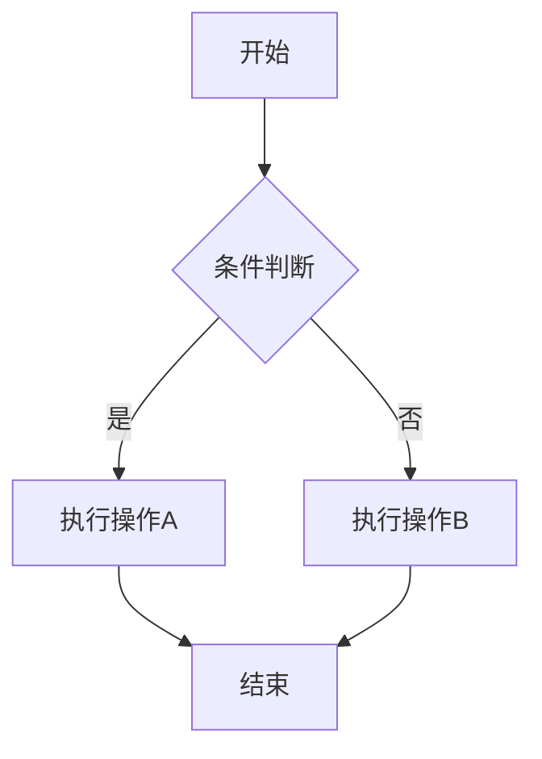
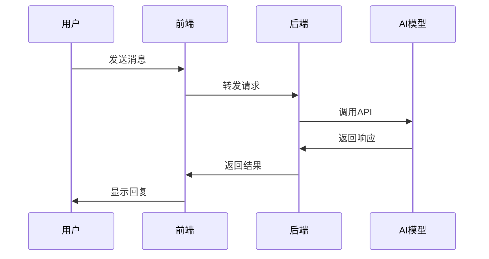
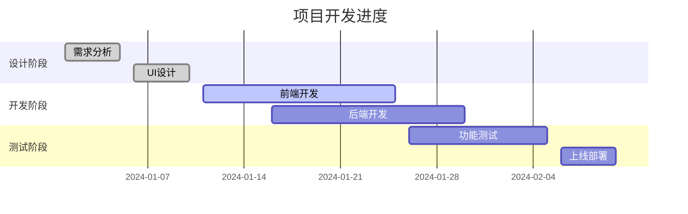
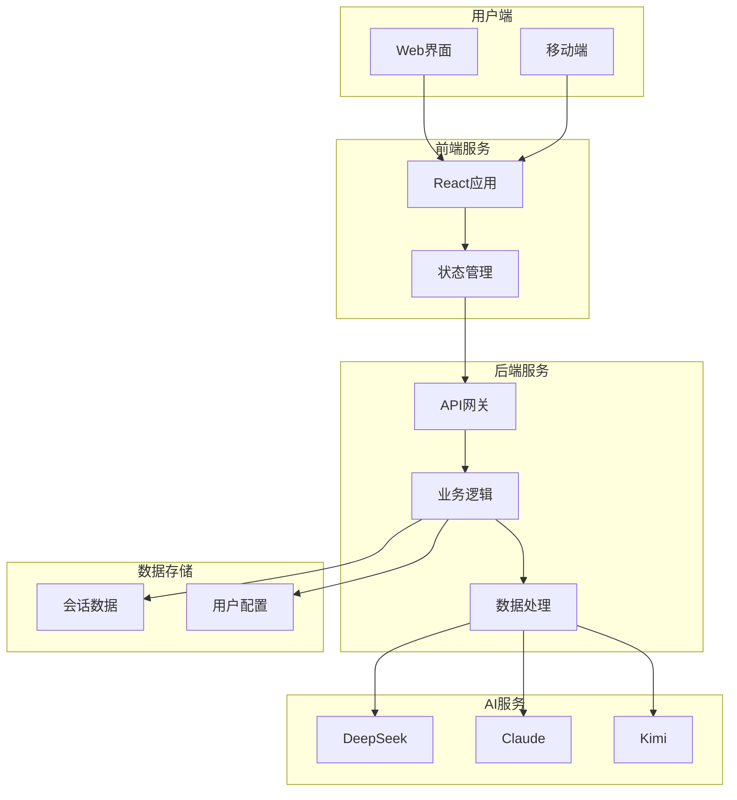

# Markdown 渲染测试示例

## 标题测试

### 三级标题
#### 四级标题

## 文本格式

这是**粗体文本**和*斜体文本*，还有`行内代码`。

这是一个包含[链接](https://github.com)的段落。

## 列表测试

### 无序列表
- 项目一
- 项目二
  - 子项目 2.1
  - 子项目 2.2
- 项目三

### 有序列表
1. 第一步
2. 第二步
3. 第三步

## 代码块测试

```javascript
function greet(name) {
  console.log(`Hello, ${name}!`);
}

greet("World");
```

```python
def fibonacci(n):
    if n <= 1:
        return n
    return fibonacci(n-1) + fibonacci(n-2)

print(fibonacci(10))
```

## 表格测试

| 功能 | 简单模式 | 高级模式 |
|------|----------|----------|
| 模型数量 | 无限制 | 最多3个 |
| 系统提示词 | 单个 | 多个主题 |
| 对比方式 | 并排 | 矩阵 |

## 引用块测试

> 这是一个引用块示例。
> 
> 可以包含多行内容，用于展示重要信息或引用文字。

## Mermaid 流程图测试



## Mermaid 时序图测试



## Mermaid 甘特图测试



## 水平分隔线

---

## 混合内容测试

这个示例展示了**markdown**和`mermaid`的混合使用效果：

1. 首先是文本描述
2. 然后是流程图：


3. 最后是总结

这样就完成了一个完整的文档示例！

## 复杂 Mermaid 示例

